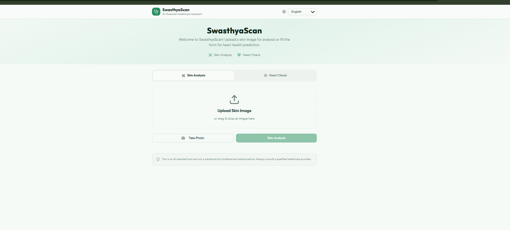

# Swastya Scan 🩺

AI-based disease detection and medicine recommendation system.

## Features
- Image-based disease prediction
- Medicine suggestions
- Affordable alternatives

## Tech Stack
- Python
- TensorFlow
- Flask

## How to Run
1. Install dependencies
2. Run app.py
## 🖥️ Screenshots

### 🏠 Home Interface
AI-powered interface for skin disease detection and heart health prediction.

  

